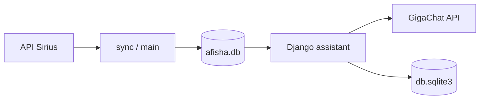

# Как устроен проект

Описание потоков данных, веб‑чата, GigaChat, ошибок и логов. Инструкции по установке и запуску — в **`DOCUMENTATION.md`**.

Печатная версия: **`docs/HOW_IT_WORKS.docx`**. Пересборка: `python scripts/build_docs_docx.py` (нужен `python-docx`).

## Общая схема

## Загрузка афиши

1. **`fetch_events.py`** — запрос к `API_URL` из `config.py`, разбор ответа.
2. **`database.py`** — схема SQLite, сохранение и выборки по событиям.
3. **`sync_afisha.py`** и **`main.py`** — синхронизация по расписанию или разово (`--once`).
4. **`sync_afisha.ensure_db`**: при пустой `afisha.db` (или с `force`) подтягивает данные; вызывается из Django и из CLI **`chat.py`**.

Источник событий для чата и афиши — файл **`afisha.db`** (путь задаётся **`DB_PATH`** в `config.py` / `.env`).

## Интеграция Django и корня репозитория

В **`hakaton/hakaton/settings.py`** в `sys.path` добавляется **`REPO_ROOT`** (родитель каталога `hakaton/`). Отсюда импортируются модули из корня репозитория: **`config`**, **`database`**, **`chat`**, **`gigachat_advisor`**.

**`assistant/views.py`** через `config.DB_PATH` находит файл афиши и передаёт путь в `database` и `gigachat_advisor`.

Маршруты: **`assistant/urls.py`**, корневое подключение в **`hakaton/urls.py`**. Обработчики **`handler404`** / **`handler500`** — в **`assistant/error_views.py`**, страницы **`assistant/templates/assistant/404.html`** и **`500.html`**.

## Чат и GigaChat

### Роль модулей

- **`gigachat_advisor.py`** — промпты, сбор контекста (каталог / карточка мероприятия), SDK **`gigachat`**. Веб‑чат: **`chat_about_event_stream`**, **`recommend_events_stream`**; CLI: **`recommend_events`** / **`recommend_events_with_usage`**.
- Учётные данные SSL и модель по умолчанию — **`config.py`** / **`.env`**.

### REST API чата: `POST /api/chat/`

Реализовано в **`assistant/views`** как **`chat_api`**.

Тело запроса — JSON:

- **`message`** — текст пользователя;
- **`chat_id`** — идентификатор потока из боковой панели.

Успешный сценарий после проверки сессии и **`ensure_db`**: ответ **`Content-Type: application/x-ndjson`**, поток строк **UTF‑8**, каждая строка — один JSON‑объект:

| `type`   | Назначение |
|----------|------------|
| `delta`  | Фрагмент текста ассистента (`text`). |
| `done`   | Конец генерации; поля **`reply`** (очищенный текст), **`reply_html`** (безопасный HTML для пузырька). |
| `error`  | Ошибка; **`message`**, **`code`** (см. ниже), **`reply_html`** для показа в UI. |

Поток строится в **`_chat_stream_ndjson_response`**: генератор сохранения сначала фиксирует сообщение пользователя (**`_append_user_turn`**), затем стримит дельты, после полного текста сохраняет ответ помощника (**`_append_assistant_turn`**). При ошибке до стрима — одна строка `error`; при ошибке в середине генерации пользователь уже в истории, дописывается ответ помощника с текстом ошибки.

Фронт: **`assistant/static/assistant/js/chat.js`** — `fetch` с чтением тела через **`ReadableStream`** (с запасным путём **`response.clone().text()`** при сбое чтения потока), разбор строк NDJSON и подстановка итогового **`reply_html`**.

Статусы **JSON** (не поток): неверный JSON, пустое сообщение, неизвестный **`chat_id`** (часть сценариев с **404** и полем **`code`**, см. код), ошибка **`ensure_db`** (**400**, **`code`** в теле ответа).

### Оформление ответов

**`assistant/formatting.py`**:

- **`clean_assistant_visible`** — убирает служебные упоминания id событий из «сырых» ответов.
- **`assistant_reply_html`** — мини‑markdown в безопасный HTML: заголовки **`#` / `##` / `###`** (регулярка с пробелом после решёток), параграфы, жирное **`**...**`**, блоки **`**Когда:**` / **`**Где:**`** с дополнительными классами. Стили — **`assistant/static/assistant/css/chat-layout.css`** (классы **`chat-rich_*`**).

### Ошибки GigaChat и сети

**`assistant/gigachat_errors.py`** централизует **`classify_chat_backend_failure(exc)`** → понятное сообщение пользователю и строка **`code`** (`upstream_timeout`, `gigachat_auth`, `http_429`, …). Обрабатываются типичные исключения **`httpx`** (таймаут, соединение, обрыв), классы **`gigachat.exceptions`** (401/403/404/429/5xx и т.д.), **`RuntimeError`** (нет ключей в `.env`, пустой ответ модели и т.п.), **`ValueError`**. В **`DEBUG=True`** часть ошибок дополняется краткой технической вставкой для разработки.

**`ndjson_chat_error_line_bytes(exc)`** формирует одну строку потока `error` с **`reply_html`**.

В журнал записывается полный traceback через **`logger.exception`** в представлениях; пользователю отдаётся уже классифицированное сообщение.

## Локальный доступ (loopback) и выбор модели

В **`assistant/local_request.py`** определяется, является ли клиент локальным (**`REMOTE_ADDR`** 127.0.0.1 / ::1 и т.д.).

Настройки в **`settings.py`** (можно переопределить через **`.env`**):

- **`ASSISTANT_LOCAL_LL_SIMPLE`** — упрощённый системный промпт «как универсальный диалог», если запрос локальный и не отключено иначе.
- **`ASSISTANT_LOCAL_RELAX_CHAT_LIMITS`**, **`CHAT_LOCAL_MESSAGES_PER_THREAD_MAX`**, **`CHAT_LOCAL_THREADS_MAX`** — более мягкие лимиты для локальных клиентов.
- **`ASSISTANT_LOCAL_GIGACHAT_BANNER`** — показывать ли блок выбора модели GigaChat в чате при loopback (**`assistant/context_processors.local_gigachat_banner`** + **`assistant/partials/local_gigachat_banner.html`**, сохранение в сессию **`local_gigachat_plan`**).

Для авторизованных пользователей выбор модели в чате (loopback) сохраняется в сессии и в **`User.gigachat_plan_slug`**; пресеты — **`GIGACHAT_PLAN_OPTIONS`** в **`settings.py`**, логика — **`gigachat_plan_prefs.py`**.

## Логирование

- **`assistant/logging_user.py`** — middleware **`AttachUserLoggingContextMiddleware`** (после аутентификации): в **`contextvars`** кладётся строка пользователя для лог‑записей; фильтр **`UserLoggingFilter`** добавляет в запись поле **`user_repr`** (вне HTTP‑запроса — **`"-"`**).
- В **`settings.py`** задан объект **`LOGGING`**: формат строки консоли/файла с **`user_repr`**, ротация файла через **`DJANGO_LOG_FILE`** (по умолчанию **`hakaton/logs/django.log`**), параметры **`DJANGO_LOG_MAX_BYTES`**, **`DJANGO_LOG_BACKUP_COUNT`**. Уровень: **`DJANGO_LOG_LEVEL`** или **`LOG_LEVEL`**.

## Хранение чатов

**`assistant/chat_storage.py`**:

- Состояние списков потоков и сообщений в сессии (**`assistant_chat_state_v2`** и связанные ключи).
- Для **`request.user.is_authenticated`** при сохранении вызывается **`sync_state_to_database`** → модели **`ChatThread`** и **`ChatMessage`** в **`hakaton/db.sqlite3`**.
- **`merge_guest_session_into_user`** переносит гостевые чаты при входе.

Заголовки и превью — **`assistant/chat_threads.py`** (в т.ч. **`suggest_chat_title`** через GigaChat).

## Регистрация и кабинет

- **`assistant/auth_views.py`**, **`forms.py`** — вход, регистрация, кабинет, смена плана GigaChat из **`GIGACHAT_PLAN_OPTIONS`** в **`settings.py`**.
- **`assistant/email_activation.py`** и шаблоны писем — подтверждение регистрации.
- **Ротация токена ссылки** (`assistant/registration_tokens.py`): в БД хранится только HMAC‑отпечаток секрета; при повторной регистрации на ту же почту, при **`POST /accounts/register/resend/`** и при повторной отправке письма вызывается **`rotate_pending_registration_token`** — старые ссылки из писем перестают работать. Повторная отправка ограничена кэшем (~60 с на адрес). После успешного перехода по ссылке запись **`PendingRegistration`** удаляется (одноразовое использование).

## Связка «афиша → чат по событию»

Запрос **`/chat/?event=<id>`** создаёт новый поток с **`focus_event_id`**, добавляет первое сообщение помощника через **`introduce_event`** или запасной текст из **`fallback_event_intro`**, редирект на **`/chat/?chat=<thread_id>`**. В промпте для сообщений этого потока используется **`_chat_for_about_event`** / **`chat_about_event_stream`**.

---

**Куда править поведение:** новые поля афиши — **`database.py`** и **`fetch_events`** / **`sync`**; промпты и контекст GigaChat — **`gigachat_advisor.py`**; тексты ошибок пользователю — **`assistant/gigachat_errors.py`**; страницы и роутинг — **`assistant/views.py`**, шаблоны и статика в **`assistant/templates`** / **`assistant/static`**.
