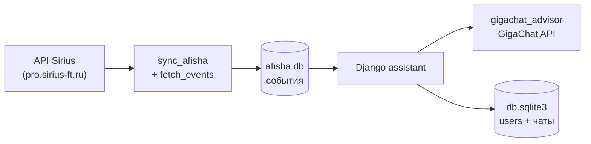

# Как устроен проект

Краткое описание потоков данных и ролей модулей без дублирования инструкций по установке (они в `DOCUMENTATION.md`).

## Общая схема

## Загрузка афиши

1. **`fetch_events.py`** — HTTP POST к `API_URL` из `config.py`, разбор JSON.
2. **`database.py`** — создание таблиц при необходимости, сохранение и выборка событий (время, описание, место и т.д.).
3. **`sync_afisha.py`** — объединяет загрузку и запись: `fetch` → `parse_events` → `save_events`.
4. **`main.py`** — CLI: один запуск или цикл с паузой.
5. **`chat.py`** — функция **`ensure_db`**: если в `afisha.db` нет событий (или передан `force`), вызывается **`sync`**, чтобы сайт и консольный чат не работали с пустой базой.

Итог: **источник истины по мероприятиям** — локальный файл **`afisha.db`** в корне (или путь из `DB_PATH`).

## Django и доступ к афише из веба

- В **`hakaton/hakaton/settings.py`** в `sys.path` добавляется **родительский каталог** репозитория (`REPO_ROOT`). Поэтому из-под Django можно импортировать модули из корня: `config`, `database`, `chat`, `gigachat_advisor`.
- **`assistant/views.py`** вычисляет путь к БД афиши через `config.DB_PATH` относительно корня репозитория.
- Страницы афиши и карточки события читают строки из SQLite через **`database.init_db`** и SQL-запросы; перед этим при необходимости вызывается **`ensure_db`**.

Маршруты задаются в **`assistant/urls.py`** и подключаются из **`hakaton/urls.py`** на корень сайта.

## Чат и GigaChat

- **`gigachat_advisor.py`** — обёртка над SDK GigaChat: системные промпты, формат «карточки» события, функции **рекомендаций по всей афише** и **диалога про одно событие**, вводное сообщение при открытии чата с мероприятиями.
- Учётные данные и опции SSL берутся из **`config.py`** (в т.ч. из `.env`).
- **`assistant/views.py`**:
  - **`chat_api`** принимает JSON (`message`, `chat_id`), поднимает состояние чата, при наличии **`focus_event_id`** у потока вызывает **`chat_about_event`**, иначе **`recommend_events`**.
  - Ответы проходят через **`formatting.clean_assistant_visible`** и **`assistant_reply_html`** для безопасного вывода в HTML.

Фронт чата: шаблон **`assistant/chat.html`** и **`static/assistant/js/chat.js`** (запросы на `api/chat/`).

## Хранение чатов (сессия и ORM)

Модуль **`assistant/chat_storage.py`**:

- Для **гостей**: состояние многопоточного чата лежит в **сессии Django** (`assistant_chat_state_v2`). Есть лимиты на число потоков и сообщений в потоке.
- Для **авторизованных пользователей**: то же состояние представлено моделями **`ChatThread`** и **`ChatMessage`** в **`assistant/models.py`** (таблицы в **`hakaton/db.sqlite3`**). При каждом сохранении выполняется синхронизация dict-состояния с БД (`sync_state_to_database`).
- При **входе** **`merge_guest_session_into_user`** переносит гостевые чаты в аккаунт, если во время сессии что-то успели написать.

Заголовки вкладок и превью обрабатываются в **`assistant/chat_threads.py`**.

## Регистрация и активация

- **`assistant/auth_views.py`** — формы входа/регистрации, выход, кабинет, активация по ссылке.
- **`assistant/email_activation.py`** — генерация токена и отправка письма.
- Новый пользователь создаётся **неактивным** (`is_active=False`) до перехода по ссылке активации.

## Связь «открыть чат с мероприятия»

Переход на **`/chat/?event=<id>`** создаёт новый поток с **`focus_event_id`**, запрашивает у **`introduce_event`** (или запасной текст) первое сообщение ассистента и перенаправляет на **`/chat/?chat=<thread_id>`**.

---

Если нужно развивать проект: новые поля афиши — в **`database.py`** и парсере **`fetch_events.parse_events`**; новые страницы — в **`assistant/views.py`** и шаблонах; изменение поведения модели — в **`gigachat_advisor.py`** (промпты и сбор контекста).
